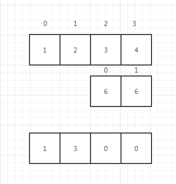

# 大数相加

tags: 'easy'

## 解题思路

传入的两个参数`a`和`b`是两个字符串，首先需要判断是否存在不能转换成数字的情况，如果有直接就抛出error

其次，需要考虑两数相加的时候的情况:

* 正常的两个数字相加，没有进位，没有最后的进位。

    ```javascript
    add('123','123') = '246'
    ```
* 有非首位的进位，但是没有最后的进位

     ```javascript
    add('123','477') = '600'
    ```
* 有非首位的进位，而且也有最后的进位

    ```javascript
    add('123','877') = '900'
    ```

* 两个数字的长度不相等。

  ```javascript
    add('123','7') = '130'
  ```

因为有需要考虑进位的情况，所以需要一个全局的字段保存上一轮的进位。然后因为有长度不相等的情况所以循环的遍历应该从尾部开始（WHY?)



如果a,b都从0开始读取则位数不一样的时候会导致相加的位数不对，因此，双方均从尾部开始，一旦有索引小于0 证明其中之一的整数读取完毕。

* 如果对于位数不相等的加法，则判断是否有索引大于等于0，有的话，就从0为到索引位数的数字截取出来进行拼装。

## 解题源码

该函数在牛客网的运行时间为14ms。可能还需要有优化的地方。
```javascript
/**
 * @param a
 * @param b
 * @returns {string}
 */
function add(a,b){
    if(!(+a&&+b)){ return 'error'} // 强转成数字，失败则返回error
    let a_length = a.length, b_length= b.length;
    let i = a_length-1,j= b_length-1; // 两个字符串的索引
    let carry = 0; //进位的获取
    let res = ''; // 结果
    while(i>= 0 && j>=0){
        let sum  = +a[i]+(+b[j])+carry // 当前位数的数字为 位数相加再加上进位
        carry = sum > 9 ? 1 : 0; // 重置进位
        res =  ''+(sum % 10)+res; // 当前位数的结果 ，因为计算的顺序是从右到左，所以拼接也是新的在前，上一轮之前的产生的结果在后
        i--;
        j--;
    }
    if(i>=0){
        return (a.substring(0,i+1)+res) // i如果大于等于0，证明a没有读完。
    }
    if(j>=0){
        return (b.substring(0,j+1)+res) // j如果大于等于0 证明b没有读完
    }
    return (carry === 1 ? ''+carry+res :res) //都读完了 ，如果首位相加大于10，要有进位。
}
```
